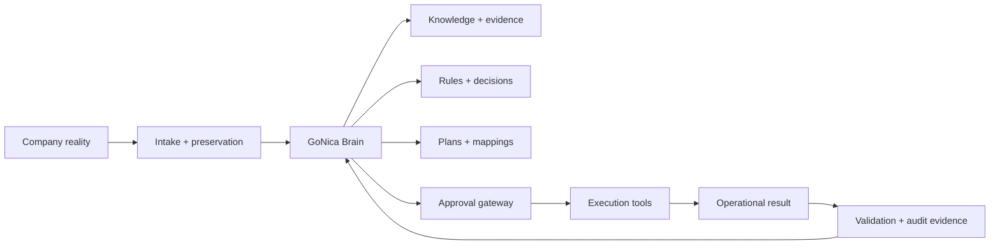

# Architecture

GoNica uses a separation-of-responsibility model so business knowledge is not trapped inside one CRM or automation platform.

## 1. Company reality

The system begins with the actual company, not with an AI prompt: CRM exports, files, process notes, workflows, customer history, field definitions, tags, pipelines, requirements, exceptions, and owner decisions.

## 2. Intake and preservation

Before transformation, original information should be preserved and profiled. The purpose is to avoid losing context while cleaning or migrating data.

## 3. GoNica Brain

The Brain is the reasoning and governance layer. It organizes evidence, maintains continuity, applies rules, produces implementation guidance, identifies uncertainty, and determines when human review is required.

It is not intended to be a general-purpose chatbot or an unrestricted autonomous agent.

## 4. Knowledge and evidence

The Brain depends on structured memory: company knowledge, CRM rules, project decisions, test results, failure records, implementation state, and authority documents.

The evidence model is designed to answer questions such as:

- What is known?
- What is inferred?
- What was actually built?
- What has been tested?
- What failed?
- What did the owner approve?
- What is safe to execute next?

## 5. Planning and compilation

From approved company information, GoNica can prepare artifacts such as field maps, tag registries, migration plans, workflow plans, implementation blueprints, snapshot/deployment checklists, and missing-decision registers.

## 6. Approval gateway

Consequential actions are separated from analysis. Sensitive changes can stop for owner review instead of being guessed or automatically executed.

## 7. Execution tools

GoHighLevel is currently a major execution environment, with other APIs and services potentially connected through controlled bridges. The execution platform stores and acts on operational objects; it is not the source of GoNica's governing intelligence.

## 8. Validation loop

Execution is followed by validation, logging, and evidence preservation. Results feed back into the Brain so future decisions are grounded in what actually happened rather than what was merely intended.

## Reusability principle

The long-term deployment pattern is:

**GoNica Core + industry/company knowledge + approved implementation package + execution adapter.**

That makes it possible to reuse proven structures while still respecting the differences between companies.
