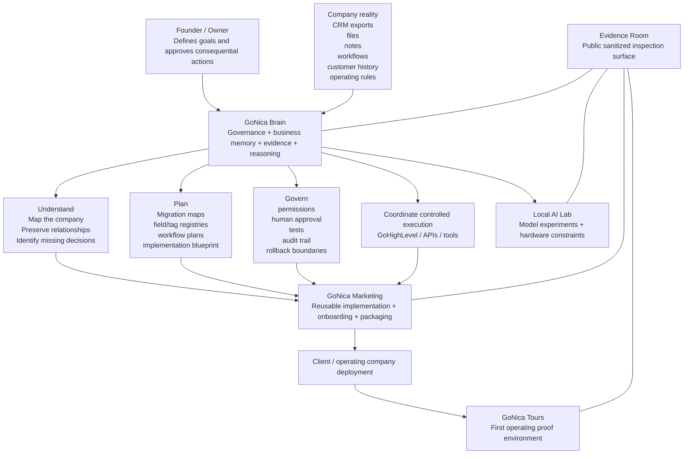
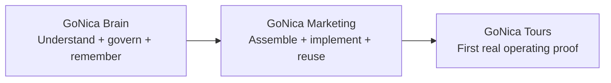

# GoNica Conceptual Map

This is the lightweight conceptual view of the project. It is intentionally rendered in Mermaid so it can be inspected directly in GitHub without image files.

## The problem in one line

A company can move its contacts to a new system and still lose how the company actually works.

## The GoNica thesis

The useful unit of migration is not only the record. It is the record **plus its context, relationships, operating rules, history, workflow logic, exceptions, approvals, and evidence**.

## The three-layer operating model

- **GoNica Brain** is the intelligence, governance, evidence, continuity, and decision layer.
- **GoNica Marketing** turns proven structures into repeatable implementations and deployment packages.
- **GoNica Tours** is the first real company environment used to prove, break, correct, and improve the system.

## Company-transition flow

```mermaid
flowchart LR
    S[Existing company / legacy systems] --> R[Discovery + data intake]
    R --> P[Preserve raw information]
    P --> M[Map fields, relationships, rules, workflows]
    M --> Q[Identify gaps + owner decisions]
    Q --> T[Test target structure]
    T --> A[Owner approval]
    A --> X[Controlled execution]
    X --> V[Validate + document + preserve evidence]
```

The objective is not unrestricted AI automation. The objective is **controlled leverage**: use AI to understand, prepare, classify, compare, and suggest while preserving a clear owner-approval boundary for consequential actions.
