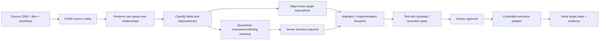

# CRM Migration & Business-Knowledge Preservation — Sanitized Case Study

**Status:** REPRESENTATIVE SANITIZED CASE / ARCHITECTURE + TEST-PATTERN EVIDENCE  
**Not a production customer claim.**

This case study demonstrates the problem GoNica Brain is designed to solve: a company can move its contacts into a new CRM and still lose the operating knowledge that makes the business function.

The example below is synthetic and sanitized. It is assembled from the migration, preservation, governance and validation patterns developed inside GoNica. It contains no customer PII, employer-confidential records, credentials or private CRM exports.

## Scenario

A service company is moving from a legacy CRM into a new operating platform.

The source system contains more than names, phone numbers and email addresses. It also contains:

- lifecycle and status fields;
- multiple phone and email variants;
- owner / salesperson relationships;
- appointment and follow-up state;
- service-area and qualification decisions;
- opt-out / suppression information;
- tags used as workflow signals;
- notes containing exceptions and context;
- historical values whose meaning is not obvious from the field name;
- automation behavior that exists partly in workflows rather than in contact records.

A contact-only migration could succeed technically while the business transition still fails operationally.

## What ordinary transfer can miss

| Source reality | Naive migration risk |
|---|---|
| `lead_status = callback_requested` | imported as generic status or omitted |
| `owner = salesperson_17` | owner relation lost or mapped to wrong user |
| `phone_2` / alternate phone | discarded because target has one obvious phone field |
| `do_not_contact = true` | contact imported without suppression context |
| workflow tag `powerdialler` | imported as a meaningless tag or not imported |
| note: “client requested after 4 PM” | left behind because notes are excluded |
| custom field with unclear semantics | guessed into a target field without owner review |
| automation referencing legacy field | target workflow recreated without dependency mapping |

The core GoNica premise is that **identity match is not the same as business-knowledge preservation**.

## GoNica transition pattern



## Step 1 — Profile before changing anything

Before migration, the source structure is treated as evidence.

A profile records, at minimum:

- field name and type;
- population / usage patterns;
- unique values where safe and useful;
- relationship dependencies;
- workflow references;
- duplicate-risk signals;
- possible target equivalents;
- ambiguity / unknown state;
- preservation requirement.

The purpose is not to immediately redesign the source company. It is to understand what exists before deciding what should happen to it.

## Step 2 — Preserve before normalizing

Representative source record:

```text
Contact ID: SYN-0042
Name: Jordan Example
Primary phone: +1-555-0100
Alternate phone: +1-555-0199
Lifecycle state: CALLBACK_REQUESTED
Assigned owner: SALES_REP_B
Suppression: SMS = TRUE
Service area decision: OUT_OF_AREA = FALSE
Appointment status: RESCHEDULE_REQUESTED
Workflow signal: POWERDIALLER
Operational note: "Prefers calls after 4 PM; kitchen project; spouse also decision-maker."
```

A migration system should not throw away a value merely because the target schema does not yet have a convenient place for it.

GoNica's intended rule is:

> **Preserve the evidence first; decide the final disposition second.**

## Step 3 — Field disposition instead of blind mapping

Each meaningful source element receives a disposition.

| Source element | Example disposition | Reason |
|---|---|---|
| Primary phone | `MAP` | direct target equivalent |
| Alternate phone | `PRESERVE + MAP/NOTE` | target structure may differ |
| Lifecycle state | `TRANSFORM` | source and target vocabularies differ |
| Assigned owner | `MAP WITH IDENTITY CONFIDENCE` | relationship must not be guessed |
| SMS suppression | `PRESERVE / ENFORCE` | consent state is operationally consequential |
| Appointment status | `TRANSFORM` | target uses controlled status vocabulary |
| Workflow signal tag | `DEPENDENCY REVIEW` | tag may exist only to drive automation |
| Free-text note | `PRESERVE` | contains operating context not represented elsewhere |
| Unknown custom field | `QUARANTINE / OWNER DECISION` | meaning cannot be inferred safely |

Representative disposition vocabulary:

```text
MAP
TRANSFORM
PRESERVE
MERGE
DEPENDENCY_REVIEW
QUARANTINE
OWNER_DECISION
DO_NOT_MIGRATE
```

The exact implementation can vary by adapter, but the governance principle remains the same: **unknown meaning is not permission to guess**.

## Step 4 — Relationship and authority checks

A migration can preserve data and still damage the company if relationships are wrong.

Examples:

- two similar employee names must not be assumed to be the same owner;
- matching a contact identity does not automatically authorize sharing all historical data into another tenant or business unit;
- a suppression / consent flag must survive channel migration;
- workflow behavior should be mapped separately from the contact record that triggers it.

GoNica therefore treats relationship confidence, consent scope and system-of-record boundaries as separate controls rather than as ordinary field mapping.

## Step 5 — Produce an implementation blueprint

The output is not simply a CSV.

A controlled migration package can contain:

1. source inventory;
2. canonical / preserved representation;
3. field disposition table;
4. identity and relationship mapping;
5. consent / suppression rules;
6. target field and workflow plan;
7. unresolved decisions;
8. test cases;
9. rollback / recovery expectations;
10. owner approval boundary.

Example unresolved-decision block:

```text
DECISION-07
Source field: legacy_priority_code
Observed values: A / B / C / blank
Meaning: not proven
Target candidate: lead_priority
Risk: incorrect transformation may alter sales routing
Status: OWNER_DECISION_REQUIRED
Execution: BLOCKED until meaning is confirmed
```

This is intentional. A blocked uncertain decision is safer than a confident-looking but unsupported migration.

## Step 6 — Test before production

Representative acceptance checks:

| Check | Expected result |
|---|---|
| All defined source fields accounted for | PASS / exception explicitly recorded |
| Suppression state survives transform | PASS |
| owner mapping uses approved identity relation | PASS |
| unknown field does not silently disappear | PASS |
| workflow dependency recorded | PASS |
| duplicate-risk case identified before write | PASS |
| unauthorized production action attempted | BLOCKED |

GoNica deliberately separates these states:

**BUILT → TESTED → OWNER-ACCEPTED → PRODUCTION-READY**

A successful synthetic test does not authorize a live customer migration.

## What this case demonstrates

The product thesis is not “AI moves CRM contacts faster.”

The thesis is that a business-system transition should preserve and reconstruct enough operating knowledge that the new system can continue to represent how the company actually works.

That requires several capabilities together:

- schema discovery;
- full-value preservation;
- relationship-aware mapping;
- workflow dependency analysis;
- unknown / conflict handling;
- consent and authority controls;
- implementation planning;
- bounded execution;
- validation and recovery evidence.

## Evidence boundary

This public example intentionally shows **method and technical structure**, not private records.

What is supported by the current GoNica evidence base:

- company-data profiling and CRM migration logic have been built in the project;
- full-field preservation / completeness validation has been exercised on selected migration cases;
- governed execution patterns and synthetic acceptance testing exist;
- the governed GoHighLevel bridge has a preserved 28/28 validation result;
- broader GoNica Brain benchmark evidence records 46 synthetic/sanitized executions: 41 PASS, 5 PARTIAL, 0 FAIL, with no critical governance failure.

What is **not** claimed here:

- that this synthetic company is a paying customer;
- that every CRM pair is already supported;
- that GoNica Brain is a finished production SaaS migration engine;
- that live production migration is authorized merely because the pattern has been tested.

## Why this matters commercially

CRM migrations are often treated as technical data movement. For an operating business, the harder problem is continuity: preserving enough of the company's relationships, history, decisions, rules and workflow behavior that the target system does not force the company to reconstruct itself manually.

GoNica Brain is being developed around that continuity problem.

---

Return to the [Technical Evidence Index](TECHNICAL_EVIDENCE_INDEX.md) or the [main Evidence Room](README.md).
