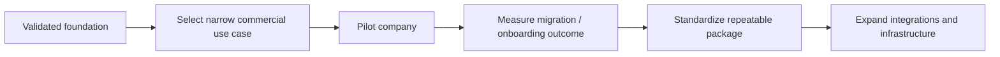

# Current State

GoNica is an **early-stage technical venture with a working governed foundation**, not a finished SaaS product.

## What exists now

- A private control-plane repository with authority, continuity, implementation, testing, and recovery records.
- A defined GoNica Brain architecture separating reasoning/governance from execution tools.
- CRM migration and preservation logic developed from real transition problems.
- Controlled GoHighLevel structures, workflows, campaign systems, and implementation patterns.
- A governed GoHighLevel bridge with synthetic acceptance testing.
- GoNica Tours as the first operating proof environment.
- GoNica Marketing as the reusable implementation and packaging layer.
- A local-AI experimentation track used to test compute feasibility and expose hardware limits.
- Savepoints, validation records, failure records, manifests, and recovery procedures.

## What is not being claimed

- GoNica is not a finished hosted AI platform.
- It is not an unrestricted autonomous system.
- It is not yet a broadly deployed commercial SaaS product.
- A component being BUILT or TESTED does not automatically mean it is PRODUCTION-READY.

## Current development direction

The strongest early commercial direction is a narrow company-onboarding / CRM-transition problem where success can be measured: preserve data and operating context, map the target system, identify missing decisions, prepare the implementation, execute only approved actions, and verify the result.

## Owner-control principle

GoNica is deliberately designed so that uncertain or consequential actions can stop for human review. The goal is not maximum autonomy. The goal is useful automation with evidence, permissions, and accountability.
