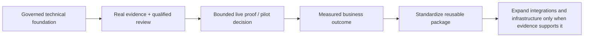

# Current State

**Updated:** August 19, 2026

GoNica is an **early-stage technical venture with a working governed foundation**, not a finished SaaS product.

GoNica Brain is broader than CRM migration. It is being developed as a governed company-intelligence and operations layer that can help reconstruct how a business works, preserve operating knowledge, identify risks and missing decisions, prepare controlled changes, test expected behavior, support human decisions, and coordinate approved execution across business systems.

CRM/system transition is currently one of the strongest use cases because it exposes the larger problem clearly: moving records does not guarantee that relationships, responsibilities, timing, workflow meaning, permissions, notifications, documents, exceptions, employee work methods, or cross-system side effects survive.

## What exists now

- A private control-plane repository with authority, continuity, implementation, testing, recovery, and evidence records.
- A defined GoNica Brain architecture separating reasoning/governance from execution tools.
- A canonical registry of **17 operational-continuity and governance contracts**.
- All **17 provider-neutral deterministic reference checks** implemented in the current offline Brain reference engine.
- An **85-execution operational-continuity evidence set**: 72 original controlled executions with 59 PASS / 13 PARTIAL / 0 FAIL, plus 13 separately preserved targeted correction regressions that all passed.
- A controlled incident-to-regression learning path that can convert validated failures/corrections into governed regression requirements.
- Human-readable analysis reports and hash-verifiable evidence bundles in the R3/R3.5 reference engine.
- Corrected and conflict/stress full-company synthetic fixtures.
- Brain unit tests included in the repository's standard Control Plane validation workflow.
- A governed GoHighLevel bridge with historical synthetic acceptance testing and bounded historical live-read evidence.
- A prepared read-only live-validation package for current HighLevel behavior; it has **not** been executed in the current R3.5 state.
- GoNica Tours as the first owner-controlled operating proof environment.
- GoNica Marketing as the reusable implementation and packaging layer, now with a live public website at **https://gonicamarketing.com/**.
- A local-AI experimentation track used to test compute feasibility and expose hardware limits.
- Savepoints, validation records, failure records, manifests, and recovery procedures.

## New evidence added after the August 17 R3.5 freeze

The freeze was a stop on speculative architecture expansion, not a stop on learning from new evidence.

### Real-evidence transition corpus

Seven public raw sources have now been acquired/normalized and evaluated through the same 17-contract engine.

Sanitized aggregate:

- **7 sources**;
- **119 contract evaluations**;
- **30 PARTIAL / 6 FAIL / 83 UNKNOWN / 0 PASS**;
- **7 verified evidence bundles**;
- **4 governed learning candidates**, all `owner_promoted:false`;
- existing Brain suite: **21/21 PASS**;
- corpus regression suite: **9/9 PASS**;
- no canonical contract or Brain-architecture change was required;
- no training/fine-tuning occurred.

This is an important difference from synthetic proof: incomplete real-world source evidence remains incomplete. The engine does not treat missing facts as success.

### Longitudinal transition evidence

A separate sanitized real-world transition record spanning June–August produced three new regression-backed rule candidates under existing Brain contracts:

1. duplicate downstream business/storage side effects must be rejected;
2. unresolved assignment must not broaden conversation/data visibility;
3. record presence must not substitute for lifecycle/business-class meaning.

The same evidence exposed three important gap candidates that are **not** yet promoted:

- source/destination record cardinality and lifecycle-state parity;
- whole-company stakeholder/department readiness before rollout;
- task work-method parity beyond task-object existence.

See [Longitudinal Business-System Transition Evidence](LONGITUDINAL_TRANSITION_EVIDENCE.md).

## Public operating/business-development state

GoNica Marketing now has a public website and is recruiting a small number of exploratory pilot partners around operational continuity for acquisitions and complex transitions.

This does **not** mean GoNica has production customers, completed pilots, recurring revenue, or broad enterprise deployment. Those outcomes remain separate gates.

## What is not being claimed

- GoNica is not a finished hosted AI platform.
- It is not an unrestricted autonomous system.
- It is not yet a broadly deployed commercial SaaS product.
- Current live HighLevel MCP/API behavior is not yet proven by the R3.5 package.
- Live cross-system operational continuity is not yet proven.
- External-customer production outcomes are not yet proven.
- The observed longitudinal transition is not being represented as a GoNica production deployment.
- A component being BUILT or TESTED does not automatically mean it is PRODUCTION-READY.

## Current development posture

The Brain reached an **R3.5 candidate-ready freeze point on August 17, 2026**. Material architecture expansion remains intentionally held unless a concrete new evidence gap, regression, qualified technical review, or explicitly authorized live-validation gate justifies change.

The commercial direction remains intentionally open enough to test the strongest entry point. CRM/system transitions and acquisition/integration continuity are measurable beachheads, but the broader product thesis is preserving and governing company operating knowledge so analysis, implementation, automation, and change can be safer and more repeatable.

## Owner-control principle

GoNica is deliberately designed so that uncertain or consequential actions can stop for human review. The goal is not maximum autonomy. The goal is useful AI-assisted operations with evidence, permissions, testing, and accountability.
