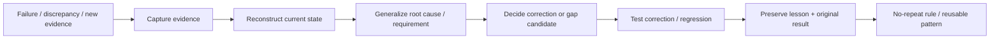

# Failures and Lessons

This project has not advanced in a straight line. The failures are part of the architecture because they explain why evidence, testing and owner control became necessary.

## Evidence Room lesson: explanation is not evidence

A public repository can describe contracts, regression suites, evidence bundles and validation discipline in accurate language and still fail as an **evidence room** if an outside engineer cannot inspect the underlying mechanism.

That happened here.

The repository had become too narrative: it explained categories of technical evidence more clearly than it exposed technical artifacts. A reviewer correctly pointed out that a README describing a 17-contract engine is not the same thing as showing contract definitions, evaluation logic and reproducible tests.

The corrective rule is now:

```text
DESCRIPTION OF EVIDENCE
!=
EVIDENCE
```

For public technical claims:

1. expose the artifact when it can responsibly be exposed; or
2. state clearly that the artifact remains private and reduce the public claim accordingly.

The Evidence Room now includes a runnable public subset of the Operational Continuity Engine with exact contract definitions, deterministic code, synthetic/adversarial fixtures and tests.

A related lesson is that project-authored tests must be labeled honestly. `21/21 PASS`, `9/9 PASS`, or similar counts are **internal regression evidence**, not independent validation.

## Repeated lesson: conversation is not state

AI can confidently describe something that is no longer current or that was never actually implemented. GoNica therefore separates discussion from durable project evidence and uses authority documents, repository state, test output, observed evidence, and owner decisions to reconstruct the current truth.

## CRM-transition lesson: data migration is not operational migration

Moving records is not enough. Migrations can lose descriptions, activity, ownership, relationships, field meaning, duplicate context, business logic, lifecycle meaning, task work methods, document roles, calendar behavior and downstream system relationships even when the contact count looks correct.

Preservation and reconciliation have to be explicit requirements.

## Identity lesson: unknown identity must stay unknown

A missing identity-bearing value should not be replaced with a shared invented substitute merely to satisfy another system.

General rule:

```text
UNKNOWN / MISSING / UNVERIFIED
!=
PERMISSION TO FABRICATE
```

Identity shortcuts can collapse distinct people or organizations downstream and corrupt document/history relationships.

## Semantic-role lesson: visible labels are not machine meaning

A business-facing label, an internal template role, a CRM owner, a technical creator, a sender and a signer can all refer to different concepts.

General rule:

```text
VISIBLE LABEL
!= INTERNAL ROLE
!= BUSINESS ROLE
!= TECHNICAL ACTOR
```

Role mappings need explicit evidence and representative end-to-end tests.

## Automation lesson: a workflow firing is not success

A workflow that exists is not necessarily safe or correct. Trigger conditions, suppression, consent, routing, ownership, idempotency and human handoff need to be validated independently.

A newer longitudinal transition example exposed duplicate downstream storage/folder outcomes from document events. That reinforced the rule:

**AUTOMATION FIRES != AUTOMATION IS OPERATIONALLY CORRECT.**

For a create-once business effect, repeated, renamed or retried events must reconcile to one intended outcome.

## Access lesson: unresolved ownership must not broaden visibility

A record being unassigned or ambiguously owned is not permission to expose more conversations or customer data.

The safer default is restriction, quarantine or explicit review until role/purpose/scope authority is known.

## Lifecycle lesson: record presence is not business meaning

A contact can exist in the destination and still be operationally unusable if employees cannot tell whether it represents a lead, active customer, lost opportunity, former customer, service-only record or another material lifecycle class.

General rule:

**CONTACT EXISTS != BUSINESS LIFECYCLE MEANING PRESERVED.**

## Whole-company rollout lesson

A sales workflow can be ready while the company transition is still incomplete.

Production/admin, service, finance, permitting, project management or other departments may depend on different work surfaces and operating relationships.

Candidate rule under continuing validation:

**SALES WORKFLOW READY != WHOLE COMPANY READY.**

This is preserved as a gap candidate rather than prematurely promoted as a new permanent Brain contract.

## Task lesson: feature parity is not work-method parity

A destination system can contain a task feature while still failing to preserve how an employee actually organizes work — categories, statuses, filters, waiting/proactive meaning, ownership views and future obligations.

Candidate rule:

**TASK OBJECT EXISTS != TASK WORK METHOD PRESERVED.**

## Real-evidence lesson: incomplete evidence should stay incomplete

The August real-evidence corpus evaluation produced many `UNKNOWN`, `PARTIAL` and some `FAIL` states rather than a page of green results.

That is intentional, but it is not automatically proof of good calibration.

If a public source does not prove a contract, GoNica should not manufacture confidence. Missing facts remain missing until stronger evidence exists. At the same time, external reviewers should challenge whether the contracts and applicability model are practical enough to produce meaningful PASS conditions when suitable evidence exists.

## Campaign lesson

Delivery and opens do not equal useful engagement. A campaign can deliver successfully and still produce zero meaningful action. Scheduling state, bounce behavior, targeting, message relevance, and click outcomes need to be inspected separately.

## Local-AI lesson

A model being technically runnable does not mean it is operationally practical. The local AI experiments demonstrated that hardware ceilings can turn a successful launch into an unusably slow workflow.

## Development lesson

Many early steps were learned by screenshot, question, attempt, error, correction, and repetition. Over time those interactions were converted into scripts, repositories, testing, documentation, manifests, governance rules and regression suites.

The project itself became the curriculum.

## Current operating response

When something fails or contradicts an assumption, the intended loop is:



The purpose of documenting failure is not to dramatize it. It is to reduce the probability of paying for the same mistake twice — including the mistake of replacing missing public proof with stronger-sounding narrative.
