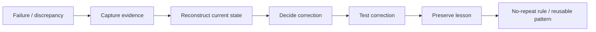

# Failures and Lessons

This project has not advanced in a straight line. The failures are part of the architecture because they explain why governance, evidence, and owner control became necessary.

## Repeated lesson: conversation is not state

AI can confidently describe something that is no longer current or that was never actually implemented. GoNica therefore separates discussion from durable project evidence and uses authority documents, repository state, test output, and owner decisions to reconstruct the current truth.

## CRM-transition lesson

Moving records is not enough. Migrations can lose descriptions, activity, ownership, relationships, field meaning, duplicate context, and business logic even when the contact count looks correct. Preservation and reconciliation have to be explicit requirements.

## Automation lesson

A workflow that exists is not necessarily safe to run. Trigger conditions, suppression, consent, routing, ownership, and human handoff need to be validated independently.

## Campaign lesson

Delivery and opens do not equal useful engagement. A campaign can deliver successfully and still produce zero meaningful action. Scheduling state, bounce behavior, targeting, message relevance, and click outcomes need to be inspected separately.

## Local-AI lesson

A model being technically runnable does not mean it is operationally practical. The local AI experiments demonstrated that hardware ceilings can turn a successful launch into an unusably slow workflow.

## Development lesson

Many early steps were learned by screenshot, question, attempt, error, correction, and repetition. Over time those interactions were converted into scripts, repositories, testing, documentation, manifests, and governance rules.

The project itself became the curriculum.

## Current operating response

When something fails, the intended loop is:

The purpose of documenting failure is not to dramatize it. It is to reduce the probability of paying for the same mistake twice.
