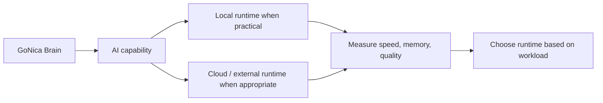

# Local AI Lab

The Local AI Lab is a **supporting experiment**, not the definition of GoNica.

Its purpose is to answer practical questions: what parts of the GoNica workload can run locally, what model sizes are feasible, where GPU/RAM limits become bottlenecks, and when better hardware or external compute would materially improve the project.

## Current workstation context

- Intel Core i5-12400
- 32 GB system RAM
- NVIDIA RTX 2060 with 6 GB VRAM
- ASRock B760M Pro RS/D4

## Recent experiment

A roughly 17 GB quantized Glimmer 30B-class model was run locally through llama.cpp/Vulkan. The model functioned, but generation performance around the observed ~1.3 tokens/second range made the configuration impractical for normal interactive use.

That result is useful because it converts a vague hardware limitation into an observable engineering constraint.

## Why this matters to GoNica

GoNica Brain may use different AI models and runtimes for analysis, extraction, classification, summarization, planning, and local/private experimentation. The architecture is intentionally model-agnostic: the business rules, evidence, permissions, and company structure should not be tied to one model vendor.

The local-model tests therefore serve as infrastructure evidence. They are not presented as the product itself.
