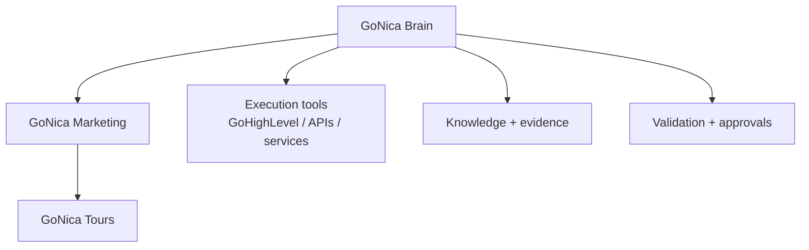

# Project Map

GoNica is not one application. It is a layered operating architecture built around one central idea: **understand and preserve the company before automating it.**

## Core structure

## GoNica Brain

The Brain is the reasoning, governance, continuity, and evidence layer. Its job is to keep track of what the company is, how it works, what information is authoritative, what has been tested, what failed, what the owner approved, and what actions are permitted.

Representative responsibilities include:

- company-data intake and profiling;
- CRM field and relationship mapping;
- preservation of important customer information;
- migration planning;
- workflow and implementation planning;
- identification of missing information and unresolved decisions;
- knowledge organization;
- tool permissions and safety boundaries;
- test and evaluation records;
- decision and continuity records.

## GoNica Marketing

GoNica Marketing is the reusable implementation layer. Its purpose is to turn proven structures into repeatable company deployments rather than rebuilding every client from zero.

The working direction includes:

- discovery and onboarding;
- CRM cleanup and migration;
- controlled field, tag, pipeline, and workflow structures;
- reusable deployment packages;
- automation and AI-assisted operations;
- validation before launch;
- documentation and handoff.

## GoNica Tours

GoNica Tours is the first operating proof environment. It gives the project a real company against which to test website systems, CRM structures, contacts, campaigns, supplier workflows, content, operational rules, and automation.

It is not the Brain itself. It is the first company being built and operated with the broader GoNica approach.

## Execution environment

GoHighLevel and other connected tools are execution systems. They can store contacts, fields, tags, opportunities, workflows, tasks, notes, campaigns, and other operational objects.

The architectural principle is:

**Brain governs; tools act.**

That separation matters because the company model, rules, and evidence should not disappear if a CRM or execution platform changes.

## Local AI Lab

The local-AI work is an experiment and capability layer, not the identity of GoNica. It tests what can be run locally, where hardware constraints appear, and where external compute or better hardware would create practical leverage.

## Evidence Room

This repository is the public review surface. It contains only deliberately selected and sanitized material so outside reviewers can understand the project without being given access to the private control plane.
