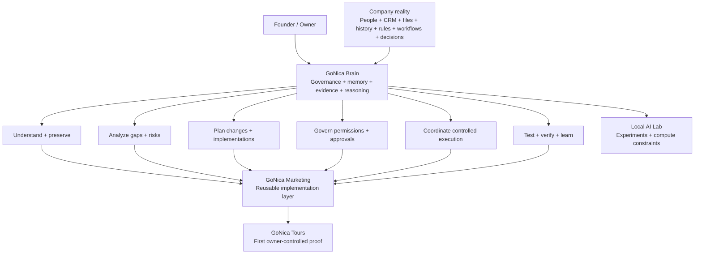

# GoNica Technical Evidence Room

**A sanitized public inspection surface for GoNica Brain.**

GoNica Brain is an early-stage governed company-intelligence and operations layer designed to help a business understand how it actually works, organize and preserve its operating knowledge, identify gaps and risks, prepare implementations or system changes, test expected behavior, and coordinate approved execution with an evidence trail.

CRM migration is one important use case, but it is not the whole product. The broader problem is that a company's operating knowledge is usually scattered across people, software, documents, workflows, relationships, rules, exceptions, history, timing, permissions, and decisions. When that knowledge is fragmented, a company can lose continuity during growth, onboarding, process changes, software transitions, acquisitions, or automation projects even when the individual tools appear to be working.

GoNica is being built to turn that operating reality into a controlled company model that can support analysis, planning, implementation, validation, human decision-making, and reusable learning.

## See the whole project in one view

[Open the full conceptual map →](CONCEPTUAL_MAP.md)

## What GoNica Brain is trying to do

The intended operating pattern is:

**DISCOVER → UNDERSTAND → PRESERVE → ANALYZE → PLAN → TEST → APPROVE → EXECUTE → VERIFY → LEARN → REUSE**

Examples of work the Brain is intended to support include:

- reconstructing how a company actually operates from evidence instead of relying only on interviews or software configuration;
- preserving business knowledge and relationships across system or staffing changes;
- identifying conflicts, missing decisions, risky assumptions, and operational dependencies;
- preparing CRM migrations, implementations, onboarding plans, workflow changes, acquisition integrations, and other controlled business-system work;
- translating discovered risks into requirements and regression tests;
- keeping consequential actions behind permissions and human approval;
- preserving evidence of what was intended, built, tested, changed, and verified;
- learning from failures and corrections so validated lessons can be reused without silently rewriting history.

## Choose how you want to inspect GoNica

### 1. Understand the human story
[**Founder Story — Why GoNica Exists**](FOUNDER_STORY.md)

How a Salesforce-to-GoHighLevel transition, a long-delayed tourism idea, automation, and a rediscovered fascination with computers converged into the project.

### 2. Understand the system
- [**Conceptual Map**](CONCEPTUAL_MAP.md) — graphical system view rendered directly in GitHub.
- [**Project Map**](PROJECT_MAP.md) — what each major part of GoNica does.
- [**Architecture**](ARCHITECTURE.md) — Brain, execution environment, evidence, approvals, and reusable deployment logic.

### 3. Inspect what exists and what has been tested
- [**Technical Evidence Index**](TECHNICAL_EVIDENCE_INDEX.md) — inspection map tying public claims to evidence categories.
- [**Selected Validation Evidence**](SELECTED_VALIDATION_EVIDENCE.md) — concrete sanitized test results and their boundaries.
- [**CRM Migration & Business-Knowledge Preservation Case Study**](CRM_MIGRATION_PRESERVATION_CASE_STUDY.md) — synthetic/sanitized architecture example.
- [**Longitudinal Business-System Transition Evidence**](LONGITUDINAL_TRANSITION_EVIDENCE.md) — sanitized real-world transition evidence converted into regressions and pending coverage gaps.
- [**Current State**](CURRENT_STATE.md)
- [**Validation Summary**](VALIDATION_SUMMARY.md)
- [**Failures and Lessons**](FAILURES_AND_LESSONS.md)
- [**Local AI Lab**](LOCAL_AI_LAB.md)

## Newer technical progress — August 18–19, 2026

The private control plane has advanced beyond the August 17 R3.5 freeze in two evidence-driven ways without changing production authority.

### Real-evidence corpus evaluation

Seven public raw sources were evaluated through the existing 17-contract Operational Continuity Engine.

Current sanitized aggregate:

- **7 acquired and normalized sources**;
- **119 contract evaluations**;
- **30 PARTIAL / 6 FAIL / 83 UNKNOWN / 0 PASS** across the source-evidence evaluations;
- **7/7 evidence bundles verified**;
- **4 governed learning candidates**, all unpromoted;
- existing Brain suite: **21/21 PASS**;
- corpus-specific regression suite: **9/9 PASS**;
- no Brain architecture or canonical-contract change was required;
- no model training or fine-tuning occurred.

The large number of UNKNOWN/PARTIAL states is intentional evidence discipline: public source material that does not prove a contract is not silently converted into PASS.

### Longitudinal transition evidence

A separate sanitized real-world transition evidence stream produced three new regression-backed rule candidates under existing contracts:

1. duplicate downstream storage/business side effects must fail idempotency/reconciliation checks;
2. unresolved assignment must not broaden data/conversation visibility;
3. record existence must not substitute for lifecycle/business-class meaning.

The same evidence also exposed three important coverage-gap candidates that remain pending rather than being forced into the current contract set:

- source/destination record cardinality + lifecycle-state parity;
- whole-company stakeholder/department readiness before rollout;
- employee task work-method parity beyond task-object existence.

[Inspect the sanitized longitudinal evidence →](LONGITUDINAL_TRANSITION_EVIDENCE.md)

## Public operating surface

GoNica Marketing now has a live public website at **https://gonicamarketing.com/** and has begun targeted pilot-partner recruitment around operational continuity for acquisitions and complex transitions.

This is a business-development milestone, **not** a production-customer or revenue claim. GoNica remains founder-led and pre-incorporation at this stage.

## Current project layers

| Layer | Role |
|---|---|
| **GoNica Brain** | Company understanding, business memory, governance, evidence, reasoning, operational continuity, testing, decision support, and controlled learning. |
| **GoNica Marketing** | Reusable implementation, onboarding, CRM/system work, workflow assembly, packaging, deployment and pilot-recruitment layer. |
| **GoNica Tours** | First owner-controlled operating proof environment where systems are tested against a real company being built. |
| **GoHighLevel / connected tools** | Execution environments. Tools act; the Brain governs what should happen, why, and under what authority. |
| **Local AI Lab** | Experimental compute layer used to test local-model feasibility and expose hardware constraints. |

## Evidence discipline

This repository deliberately distinguishes:

- **BUILT** — implemented in some form.
- **TESTED** — exercised against defined test cases.
- **OWNER-ACCEPTED** — reviewed and accepted by the owner.
- **PRODUCTION-READY** — separately authorized for live use.

A successful experiment is not automatically a production claim. A later correction does not erase an earlier partial result; both remain part of the evidence history.

## Public-sanitization boundary

This repository is **not** the private GoNica control plane. It intentionally excludes credentials, OAuth secrets, production tokens, unrestricted private source material, raw customer PII, private CRM databases, contact lists, employer data, implementation-vendor private communications, and other material that does not belong in a public technical review surface.

## Why this repository exists

It is meant for technical reviewers, accelerators, partners, hardware and infrastructure companies, potential co-founders, mentors, pilot partners, and other people deciding whether GoNica deserves deeper diligence or support.

The goal is not to ask a reviewer to trust a pitch. The goal is to give them enough structure and evidence to **inspect the project for themselves**.
