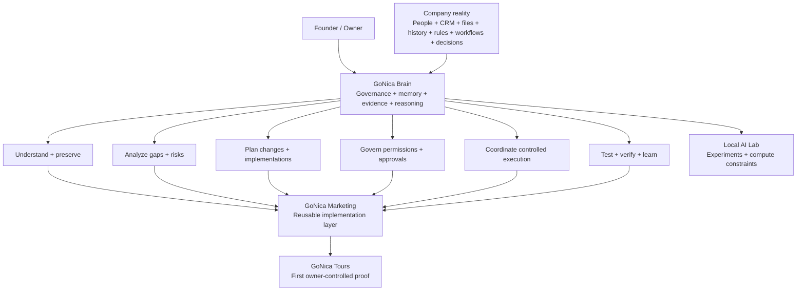

# GoNica Technical Evidence Room

**A sanitized public inspection surface for GoNica Brain.**

GoNica Brain is an early-stage governed company-intelligence and operations layer designed to help a business understand how it actually works, organize and preserve its operating knowledge, identify gaps and risks, prepare implementations or system changes, test expected behavior, and coordinate approved execution with an evidence trail.

CRM migration is one important use case, but it is not the whole product. The broader problem is that a company's operating knowledge is usually scattered across people, software, documents, workflows, relationships, rules, exceptions, history, timing, permissions, and decisions. When that knowledge is fragmented, a company can lose continuity during growth, onboarding, process changes, software transitions, or automation projects even when the individual tools appear to be working.

GoNica is being built to turn that operating reality into a controlled company model that can support analysis, planning, implementation, validation, human decision-making, and reusable learning.

## See the whole project in one view

[Open the full conceptual map →](CONCEPTUAL_MAP.md)

## What GoNica Brain is trying to do

The intended operating pattern is:

**DISCOVER → UNDERSTAND → PRESERVE → ANALYZE → PLAN → TEST → APPROVE → EXECUTE → VERIFY → LEARN → REUSE**

Examples of work the Brain is intended to support include:

- reconstructing how a company actually operates from evidence instead of relying only on interviews or software configuration;
- preserving business knowledge and relationships across system or staffing changes;
- identifying conflicts, missing decisions, risky assumptions, and operational dependencies;
- preparing CRM migrations, implementations, onboarding plans, workflow changes, and other controlled business-system work;
- translating discovered risks into requirements and regression tests;
- keeping consequential actions behind permissions and human approval;
- preserving evidence of what was intended, built, tested, changed, and verified;
- learning from failures and corrections so validated lessons can be reused without silently rewriting history.

## Choose how you want to inspect GoNica

### 1. Understand the human story
[**Founder Story — Why GoNica Exists**](FOUNDER_STORY.md)

How a Salesforce-to-GoHighLevel transition, a long-delayed tourism idea, automation, and a rediscovered fascination with computers converged into the project.

### 2. Understand the system
- [**Conceptual Map**](CONCEPTUAL_MAP.md) — graphical system view rendered directly in GitHub.
- [**Project Map**](PROJECT_MAP.md) — what each major part of GoNica does.
- [**Architecture**](ARCHITECTURE.md) — Brain, execution environment, evidence, approvals, and reusable deployment logic.

### 3. Inspect what exists and what has been tested
- [**Technical Evidence Index**](TECHNICAL_EVIDENCE_INDEX.md) — inspection map tying public claims to evidence categories.
- [**Selected Validation Evidence**](SELECTED_VALIDATION_EVIDENCE.md) — concrete sanitized test results and their boundaries, including the newer operational-continuity regression evidence.
- [**CRM Migration & Business-Knowledge Preservation Case Study**](CRM_MIGRATION_PRESERVATION_CASE_STUDY.md) — one synthetic, sanitized use case showing why migration is more than contact transfer.
- [**Current State**](CURRENT_STATE.md)
- [**Validation Summary**](VALIDATION_SUMMARY.md)
- [**Failures and Lessons**](FAILURES_AND_LESSONS.md)
- [**Local AI Lab**](LOCAL_AI_LAB.md)

## Newer technical progress — August 17, 2026

Since the first public Evidence Room was assembled, the private control plane has advanced materially. Sanitized current evidence now supports the following claims:

- a canonical registry of **17 operational-continuity and governance contracts** exists;
- a newer operational-continuity regression program records **85 total controlled executions**, preserving the original partial results and the later targeted corrections separately;
- all **17 provider-neutral deterministic reference checks** are implemented in the current offline Brain engine;
- a controlled incident-to-regression learning path, human-readable analysis report, and hash-verifiable evidence bundle are implemented in the R3/R3.5 reference engine;
- realistic corrected and conflict/stress full-company synthetic cases are part of the current test package;
- Brain unit tests are now included in the repository's standard Control Plane validation workflow;
- a candidate-review demo and sanitized live-evidence capture interfaces have been prepared;
- material Brain expansion is intentionally frozen while the founder seeks qualified technical review/co-founder input or a concrete new validation gate.

These are **technical-development claims, not customer-traction or production claims**. Current live cross-system behavior, broad external deployment, and external-customer outcomes remain unproven.

## Current project layers

| Layer | Role |
|---|---|
| **GoNica Brain** | Company understanding, business memory, governance, evidence, reasoning, operational continuity, testing, decision support, and controlled learning. |
| **GoNica Marketing** | Reusable implementation, onboarding, CRM/system work, workflow assembly, packaging, and deployment layer. |
| **GoNica Tours** | First owner-controlled operating proof environment where systems are tested against a real company being built. |
| **GoHighLevel / connected tools** | Execution environments. Tools act; the Brain governs what should happen, why, and under what authority. |
| **Local AI Lab** | Experimental compute layer used to test local-model feasibility and expose hardware constraints. |

## Evidence discipline

This repository deliberately distinguishes:

- **BUILT** — implemented in some form.
- **TESTED** — exercised against defined test cases.
- **OWNER-ACCEPTED** — reviewed and accepted by the owner.
- **PRODUCTION-READY** — separately authorized for live use.

A successful experiment is not automatically a production claim. A later correction does not erase an earlier partial result; both remain part of the evidence history.

## Public-sanitization boundary

This repository is **not** the private GoNica control plane. It intentionally excludes credentials, OAuth secrets, production tokens, unrestricted private source material, raw customer PII, private CRM databases, contact lists, employer data, and other material that does not belong in a public technical review surface.

## Why this repository exists

It is meant for technical reviewers, accelerators, partners, hardware and infrastructure companies, potential co-founders, mentors, and other people deciding whether GoNica deserves deeper diligence or support.

The goal is not to ask a reviewer to trust a pitch. The goal is to give them enough structure and evidence to **inspect the project for themselves**.
