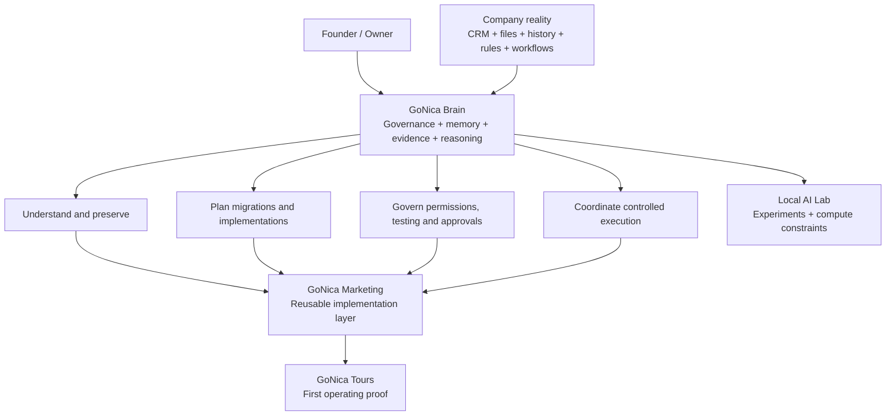

# GoNica Technical Evidence Room

**A sanitized public inspection surface for GoNica Brain.**

GoNica Brain is an early-stage business-intelligence and automation architecture designed to help companies preserve how they operate when they change systems, especially during CRM transitions, onboarding, consolidation, and operational reconstruction.

The central problem is simple: a company can successfully move its contacts into a new CRM and still lose the knowledge that makes the company work — history, relationships, fields, rules, workflows, exceptions, responsibilities, approvals, and decisions.

GoNica is being built to understand that operating reality, preserve it, map it into a controlled target structure, prepare migrations and implementations, coordinate approved execution, and keep an evidence trail of what happened.

## See the whole project in one view

[Open the full conceptual map →](CONCEPTUAL_MAP.md)

## Choose how you want to inspect GoNica

### 1. Understand the human story
[**Founder Story — Why GoNica Exists**](FOUNDER_STORY.md)

How a Salesforce-to-GoHighLevel transition, a long-delayed tourism idea, automation, and a rediscovered fascination with computers converged into the project.

### 2. Understand the system
- [**Conceptual Map**](CONCEPTUAL_MAP.md) — graphical system view rendered directly in GitHub.
- [**Project Map**](PROJECT_MAP.md) — what each major part of GoNica does.
- [**Architecture**](ARCHITECTURE.md) — Brain, execution environment, evidence, approvals, and reusable deployment logic.

### 3. Inspect what exists and what has been tested
- [**Technical Evidence Index**](TECHNICAL_EVIDENCE_INDEX.md) — Phase 2 inspection map tying public claims to evidence categories.
- [**Selected Validation Evidence**](SELECTED_VALIDATION_EVIDENCE.md) — concrete sanitized test results and their boundaries.
- [**CRM Migration & Business-Knowledge Preservation Case Study**](CRM_MIGRATION_PRESERVATION_CASE_STUDY.md) — a synthetic, sanitized end-to-end example showing why migration is more than contact transfer.
- [**Current State**](CURRENT_STATE.md)
- [**Validation Summary**](VALIDATION_SUMMARY.md)
- [**Failures and Lessons**](FAILURES_AND_LESSONS.md)
- [**Local AI Lab**](LOCAL_AI_LAB.md)

## Phase 2: deeper technical proof

The first version of this repository established the product definition, founder origin, architecture, validation discipline and current-state boundaries. Phase 2 adds more inspectable evidence without turning the private control plane into a public dump.

Current Phase 2 additions include:
- a technical evidence index;
- selected numerical validation results;
- explicit test-versus-production boundaries;
- a sanitized CRM migration / business-knowledge preservation case study;
- a publication rule for future workflow, benchmark and configuration artifacts.

## What GoNica is trying to make possible

A small company should be able to move, reorganize, or modernize its operating systems without throwing away institutional knowledge. AI can help analyze, classify, compare, summarize, map, and prepare the work, while consequential actions remain governed by permissions, testing, evidence, and human approval.

The intended pattern is:

**DISCOVER → UNDERSTAND → PRESERVE → MAP → TEST → APPROVE → EXECUTE → VERIFY → REUSE**

## Current project layers

| Layer | Role |
|---|---|
| **GoNica Brain** | Business memory, governance, evidence, reasoning, permissions, continuity, and decision support. |
| **GoNica Marketing** | Reusable implementation, onboarding, CRM migration, workflow assembly, packaging, and deployment layer. |
| **GoNica Tours** | First operating proof environment where systems are tested against a real company being built. |
| **GoHighLevel / connected tools** | Execution environment. Tools act; the Brain governs what should happen and why. |
| **Local AI Lab** | Experimental compute layer used to test local-model feasibility and expose hardware constraints. |

## Evidence discipline

This repository deliberately distinguishes:

- **BUILT** — implemented in some form.
- **TESTED** — exercised against defined test cases.
- **OWNER-ACCEPTED** — reviewed and accepted by the owner.
- **PRODUCTION-READY** — separately authorized for live use.

A successful experiment is not automatically a production claim.

## Public-sanitization boundary

This repository is **not** the private GoNica control plane. It intentionally excludes credentials, OAuth secrets, production tokens, unrestricted private source material, raw customer PII, private CRM databases, contact lists, employer data, and other material that does not belong in a public technical review surface.

## Why this repository exists

It is meant for technical reviewers, accelerators, partners, hardware and infrastructure companies, potential mentors, and other people deciding whether GoNica deserves deeper diligence or support.

The goal is not to ask a reviewer to trust a pitch. The goal is to give them enough structure and evidence to **inspect the project for themselves**.
