# Technical Evidence Index

This page is the public inspection layer for GoNica Brain.

The purpose is to make it easier for a technical reviewer to distinguish **product thesis**, **architecture**, **implemented capability**, **test evidence**, **observational learning**, **owner decisions**, and **production authorization** without requiring access to the private GoNica control plane.

## Status vocabulary

| Status | Meaning |
|---|---|
| **BUILT** | Implemented in some form. |
| **TESTED** | Exercised against defined test cases. |
| **OBSERVED** | Supported by sanitized real-world evidence, without implying GoNica production deployment. |
| **OWNER-ACCEPTED** | Reviewed and accepted by the owner. |
| **PRODUCTION-READY** | Separately authorized for live production use. |

Passing a test does not automatically advance a component into production.

## Evidence map

| Evidence area | Public inspection point | Current public claim |
|---|---|---|
| Product definition | [README](README.md) | GoNica Brain is a governed company-intelligence and operations layer; CRM migration is one use case, not the whole product. |
| System structure | [Conceptual Map](CONCEPTUAL_MAP.md) | Company reality flows through Brain governance into controlled analysis, planning and execution. |
| Project relationship | [Project Map](PROJECT_MAP.md) | Brain, Marketing, Tours and Local AI have separate roles. |
| Architecture | [Architecture](ARCHITECTURE.md) | Intake, company understanding, evidence, planning, governance, execution and validation are separated. |
| Current implementation state | [Current State](CURRENT_STATE.md) | R3.5 governed foundation exists; newer real evidence has extended validation without opening production authority. |
| Validation method | [Validation Summary](VALIDATION_SUMMARY.md) | Design/build/test/observation/owner/production states are kept separate, and corrections do not erase original evidence. |
| Selected concrete test evidence | [Selected Validation Evidence](SELECTED_VALIDATION_EVIDENCE.md) | Earlier benchmark, 85-execution continuity evidence, real-evidence corpus evaluation, and incident-derived regressions. |
| CRM/system transition use case | [CRM Migration Case Study](CRM_MIGRATION_PRESERVATION_CASE_STUDY.md) | Migration evidence helped reveal the broader operational-continuity problem. |
| Longitudinal real-world evidence | [Longitudinal Transition Evidence](LONGITUDINAL_TRANSITION_EVIDENCE.md) | Multi-week sanitized transition evidence has produced regression-backed rules and explicit pending coverage gaps. |
| Failure discipline | [Failures and Lessons](FAILURES_AND_LESSONS.md) | Failures, partials and incomplete assumptions are preserved rather than hidden. |
| Local model experimentation | [Local AI Lab](LOCAL_AI_LAB.md) | Local compute work is supporting evidence, not the product thesis. |
| Founder origin | [Founder Story](FOUNDER_STORY.md) | Real business-system transition problems led to the architecture. |

## Current sanitized technical proof points

The private control plane currently supports these bounded public statements:

1. **17 canonical continuity/governance contracts** are maintained in a machine-readable registry.
2. **17/17 deterministic provider-neutral reference checks** are implemented in the current offline Brain reference engine.
3. The operational-continuity evidence history contains **85 controlled executions**: 72 original executions plus 13 separately recorded targeted correction regressions.
4. The 72 original executions remain **59 PASS / 13 PARTIAL / 0 FAIL**; the 13 partials were not retroactively rewritten.
5. The 13 targeted correction regressions are **13 PASS / 0 PARTIAL / 0 FAIL**.
6. R3/R3.5 includes a controlled learning path, human-readable report generation, and hash-verifiable evidence bundles.
7. Brain tests are included in the standard private Control Plane validation workflow.
8. Seven public-source datasets have been evaluated through the existing contract engine, producing **119 source-evidence evaluations** with incomplete/unknown states preserved rather than upgraded to PASS.
9. The real-evidence corpus produced **4 governed learning candidates**; existing Brain tests remained **21/21 PASS** and corpus regressions **9/9 PASS** without changing the canonical 17-contract architecture.
10. A separate sanitized longitudinal transition evidence stream generated **3 new regression-backed rule candidates** under existing contracts.
11. That same evidence exposed **3 important coverage-gap candidates** that remain pending rather than being promoted prematurely.
12. The existing governed HighLevel bridge remains a proven historical asset; a prepared read-only live-proof package remains a separate, not-yet-completed gate.
13. Current external-customer production outcomes and live cross-system continuity remain unproven.

## Evidence ladder

```mermaid
flowchart LR
    A[Problem observed] --> B[Evidence captured]
    B --> C[Architecture / requirement defined]
    C --> D[Component or rule built]
    D --> E[Synthetic / sanitized regression]
    E --> F[Failure, partial, unknown or pass recorded]
    F --> G[Correction / learning candidate]
    G --> H[Owner review]
    H --> I[Separate live / production decision]
```

## Why the real-evidence results include UNKNOWN and FAIL

The Brain is not evaluated by how many green labels it can produce. Public source material may not prove all of the facts needed for an operational-continuity contract.

Therefore:

- missing facts remain `UNKNOWN`;
- incomplete support remains `PARTIAL`;
- explicit contradictory/unsafe evidence can become `FAIL`;
- only sufficient evidence becomes `PASS`.

That behavior is itself part of the evidence discipline.

## What the private control plane contains that is not published here

The private evidence base includes more detailed authority documents, machine-readable registries, implementation records, test fixtures, manifests, savepoints, recovery material, configuration evidence, raw public-source acquisition artifacts, and private operational history.

That material is intentionally reduced before public release. This repository does **not** publish credentials, tokens, unrestricted private source material, customer PII, raw CRM databases, contact lists, employer data, implementation-vendor private communications, or sensitive operating records.

## Publication rule

A new artifact belongs in this public repository only when all three are true:

1. it materially helps a reviewer evaluate GoNica;
2. it can be sanitized without destroying its technical meaning;
3. publishing it does not weaken privacy, security, customer confidentiality or owner control.

The goal is not maximum disclosure. The goal is **inspectable proof with disciplined boundaries**.
