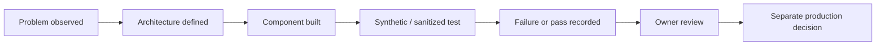

# Technical Evidence Index

This page is the Phase 2 inspection layer for GoNica Brain.

The purpose is to make it easier for a technical reviewer to distinguish **architecture**, **implemented capability**, **test evidence**, **owner decisions**, and **production authorization** without requiring access to the private GoNica control plane.

## Status vocabulary

| Status | Meaning |
|---|---|
| **BUILT** | Implemented in some form. |
| **TESTED** | Exercised against defined test cases. |
| **OWNER-ACCEPTED** | Reviewed and accepted by the owner. |
| **PRODUCTION-READY** | Separately authorized for live production use. |

Passing a test does not automatically advance a component into production.

## Evidence map

| Evidence area | Public inspection point | Current public claim |
|---|---|---|
| Product definition | [README](README.md) | GoNica Brain is the governed company-intelligence / automation layer, not a CRM or foundation model. |
| System structure | [Conceptual Map](CONCEPTUAL_MAP.md) | Company reality flows through Brain governance into controlled execution. |
| Project relationship | [Project Map](PROJECT_MAP.md) | Brain, Marketing, Tours and Local AI have separate roles. |
| Architecture | [Architecture](ARCHITECTURE.md) | Intake, company model, migration intelligence, governance, execution and validation are separated. |
| Current implementation state | [Current State](CURRENT_STATE.md) | Governed foundation exists; finished SaaS is not claimed. |
| Validation method | [Validation Summary](VALIDATION_SUMMARY.md) | Design/build/test/owner/production states are kept separate. |
| Selected concrete test evidence | [Selected Validation Evidence](SELECTED_VALIDATION_EVIDENCE.md) | Sanitized numerical results and boundaries from selected test programs. |
| Failure discipline | [Failures and Lessons](FAILURES_AND_LESSONS.md) | Failures and incomplete assumptions are preserved rather than hidden. |
| Local model experimentation | [Local AI Lab](LOCAL_AI_LAB.md) | Local compute work is supporting evidence, not the product thesis. |
| Founder origin | [Founder Story](FOUNDER_STORY.md) | Business-system transition problems led to the architecture. |

## Evidence ladder

## What the private control plane contains that is not published here

The private evidence base includes more detailed authority documents, implementation records, test fixtures, manifests, savepoints, recovery material, configuration evidence and operational history.

That material is intentionally reduced before public release. This repository does **not** publish credentials, tokens, unrestricted private source material, customer PII, raw CRM databases, contact lists, employer data or sensitive operating records.

## Phase 2 publication rule

A new artifact belongs in this public repository only when all three are true:

1. it materially helps a reviewer evaluate GoNica;
2. it can be sanitized without destroying its technical meaning;
3. publishing it does not weaken privacy, security, customer confidentiality or owner control.

The goal is not maximum disclosure. The goal is **inspectable proof with disciplined boundaries**.
