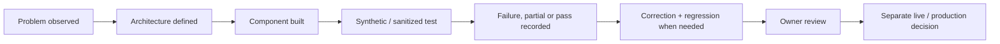

# Technical Evidence Index

This page is the public inspection layer for GoNica Brain.

The purpose is to make it easier for a technical reviewer to distinguish **product thesis**, **architecture**, **implemented capability**, **test evidence**, **owner decisions**, and **production authorization** without requiring access to the private GoNica control plane.

## Status vocabulary

| Status | Meaning |
|---|---|
| **BUILT** | Implemented in some form. |
| **TESTED** | Exercised against defined test cases. |
| **OWNER-ACCEPTED** | Reviewed and accepted by the owner. |
| **PRODUCTION-READY** | Separately authorized for live production use. |

Passing a test does not automatically advance a component into production.

## Evidence map

| Evidence area | Public inspection point | Current public claim |
|---|---|---|
| Product definition | [README](README.md) | GoNica Brain is a governed company-intelligence and operations layer; CRM migration is one use case, not the whole product. |
| System structure | [Conceptual Map](CONCEPTUAL_MAP.md) | Company reality flows through Brain governance into controlled analysis, planning and execution. |
| Project relationship | [Project Map](PROJECT_MAP.md) | Brain, Marketing, Tours and Local AI have separate roles. |
| Architecture | [Architecture](ARCHITECTURE.md) | Intake, company understanding, evidence, planning, governance, execution and validation are separated. |
| Current implementation state | [Current State](CURRENT_STATE.md) | R3.5 candidate-ready governed foundation exists; finished SaaS and broad live proof are not claimed. |
| Validation method | [Validation Summary](VALIDATION_SUMMARY.md) | Design/build/test/owner/production states are kept separate, and corrections do not erase original partial evidence. |
| Selected concrete test evidence | [Selected Validation Evidence](SELECTED_VALIDATION_EVIDENCE.md) | Earlier 46-case benchmark plus newer 85-execution operational-continuity evidence and R3/R3.5 reference-engine boundaries. |
| CRM/system transition use case | [CRM Migration Case Study](CRM_MIGRATION_PRESERVATION_CASE_STUDY.md) | Migration evidence helped reveal the broader operational-continuity problem. |
| Failure discipline | [Failures and Lessons](FAILURES_AND_LESSONS.md) | Failures and incomplete assumptions are preserved rather than hidden. |
| Local model experimentation | [Local AI Lab](LOCAL_AI_LAB.md) | Local compute work is supporting evidence, not the product thesis. |
| Founder origin | [Founder Story](FOUNDER_STORY.md) | Real business-system transition problems led to the architecture. |

## Current sanitized technical proof points

The private control plane currently supports these bounded public statements:

1. **17 canonical continuity/governance contracts** are maintained in a machine-readable registry.
2. **17/17 deterministic provider-neutral reference checks** are implemented in the current offline Brain reference engine.
3. The newer operational-continuity evidence history contains **85 controlled executions**: 72 original executions plus 13 separately recorded targeted correction regressions.
4. The 72 original executions remain **59 PASS / 13 PARTIAL / 0 FAIL**; the 13 partials were not retroactively rewritten.
5. The 13 targeted correction regressions are **13 PASS / 0 PARTIAL / 0 FAIL**.
6. R3/R3.5 includes a controlled learning path, human-readable report generation, and hash-verifiable evidence bundles for synthetic cases.
7. Brain tests are included in the standard private Control Plane validation workflow.
8. The existing governed HighLevel bridge remains a proven historical asset; a new read-only live-proof package is prepared but not currently executed.
9. Current external-customer production outcomes and live cross-system continuity remain unproven.

## Evidence ladder

## What the private control plane contains that is not published here

The private evidence base includes more detailed authority documents, machine-readable registries, implementation records, test fixtures, manifests, savepoints, recovery material, configuration evidence and operational history.

That material is intentionally reduced before public release. This repository does **not** publish credentials, tokens, unrestricted private source material, customer PII, raw CRM databases, contact lists, employer data or sensitive operating records.

## Publication rule

A new artifact belongs in this public repository only when all three are true:

1. it materially helps a reviewer evaluate GoNica;
2. it can be sanitized without destroying its technical meaning;
3. publishing it does not weaken privacy, security, customer confidentiality or owner control.

The goal is not maximum disclosure. The goal is **inspectable proof with disciplined boundaries**.
