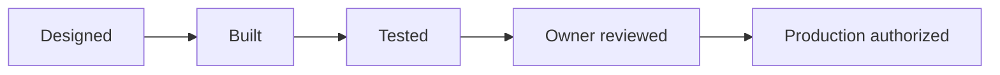

# Validation Summary

GoNica treats testing as separate from discussion and design. A feature can be described, implemented, tested, owner-accepted, and production-authorized at different times.

## Selected validated areas

- **Operational-continuity regression:** 72 original controlled executions recorded 59 PASS / 13 PARTIAL / 0 FAIL. The 13 original partials were preserved and separately followed by 13 targeted correction regressions, all of which passed. This produces an 85-execution evidence history without rewriting the original results.
- **Canonical Brain controls:** 17 operational-continuity/governance contracts are maintained in a machine-readable registry, and all 17 provider-neutral deterministic reference checks are implemented in the current offline reference engine.
- **Controlled learning:** the R3/R3.5 reference engine can promote validated incident/correction evidence into governed regression requirements while preserving source evidence and human-review boundaries.
- **Human-readable evidence:** the current reference engine can generate analysis reports and hash-verifiable evidence bundles from synthetic company cases.
- **Repository CI:** Brain unit tests are included in the standard private Control Plane validation workflow before manifest reconciliation.
- **Governed GoHighLevel bridge:** historical synthetic/sanitized acceptance tests completed successfully across the selected test set; bounded historical live-read evidence also exists.
- **CRM migration/preservation:** selected offline validation demonstrated preservation and mapping behavior on defined cases.
- **Safety boundaries:** production and external execution can remain intentionally blocked even when lower-level tests pass.

## Validation pattern



These states are intentionally not collapsed into one label.

## Correction discipline

GoNica does not convert an earlier PARTIAL into a historical PASS simply because a correction later succeeds.

The evidence pattern is:

```text
ORIGINAL RESULT -> IDENTIFIED GAP -> CORRECTION CONTRACT / REQUIREMENT -> TARGETED REGRESSION -> NEW RESULT
```

That distinction matters because the project is intended to learn from mistakes without erasing them.

## Why this matters

AI-assisted development can create a dangerous illusion of completion. A system may sound coherent in conversation while the actual implementation is incomplete, stale, or unverified. GoNica therefore attempts to preserve evidence of the real state instead of relying on narrative memory alone.

## Evidence categories used internally

- Authority and scope documents
- Implementation artifacts
- Test output
- Synthetic/sanitized acceptance cases
- Failure and exception records
- Contract/requirement registries
- Hashes and manifests
- Savepoints and continuation records
- Owner decisions and production gates

## Current validation boundary

The current public evidence supports meaningful **offline/synthetic technical development claims**. It does not establish broad production readiness. Current live HighLevel behavior, live cross-system continuity, production rollback/compensation, and external-customer outcomes remain separate validation gates.

## Public-room limitation

This repository provides a reduced review surface. The private control plane contains substantially more detailed evidence, but unrestricted private source material, credentials, customer information, and sensitive operational data are intentionally excluded here.
