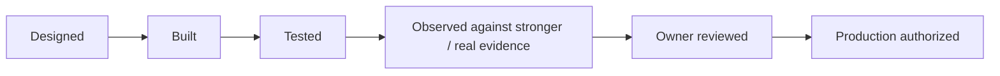

# Validation Summary

**Updated:** August 19, 2026

GoNica treats testing as separate from discussion, design, observation and production use. A capability can be described, implemented, tested, observed against real evidence, owner-accepted, and production-authorized at different times.

## Selected validated areas

- **Operational-continuity regression:** 72 original controlled executions recorded 59 PASS / 13 PARTIAL / 0 FAIL. The 13 original partials were preserved and separately followed by 13 targeted correction regressions, all of which passed. This produces an 85-execution evidence history without rewriting the original results.
- **Canonical Brain controls:** 17 operational-continuity/governance contracts are maintained in a machine-readable registry, and all 17 provider-neutral deterministic reference checks are implemented in the current offline reference engine.
- **Controlled learning:** the R3/R3.5 reference engine can route incident/correction evidence through evidence → incident → root cause → generalized rule → migration requirement → regression, while preserving privacy and human-review boundaries.
- **Human-readable evidence:** the current reference engine can generate analysis reports and hash-verifiable evidence bundles from synthetic or sanitized company cases.
- **Repository CI:** Brain unit tests are included in the standard private Control Plane validation workflow before manifest reconciliation.
- **Governed GoHighLevel bridge:** historical synthetic/sanitized acceptance tests completed successfully across the selected test set; bounded historical live-read evidence also exists.
- **CRM migration/preservation:** selected offline validation demonstrated preservation and mapping behavior on defined cases.
- **Real-evidence corpus:** seven public-source datasets have been evaluated through the same 17-contract engine, with missing/incomplete evidence retained as UNKNOWN/PARTIAL instead of upgraded to PASS.
- **Incident-derived regressions:** a separate sanitized longitudinal transition evidence stream generated three new regression-backed rule candidates under existing contracts.
- **Safety boundaries:** production and external execution can remain intentionally blocked even when lower-level tests pass.

## Validation pattern



These states are intentionally not collapsed into one label.

## Correction discipline

GoNica does not convert an earlier PARTIAL into a historical PASS simply because a correction later succeeds.

The evidence pattern is:

```text
ORIGINAL RESULT
→ IDENTIFIED GAP
→ CORRECTION CONTRACT / REQUIREMENT
→ TARGETED REGRESSION
→ NEW RESULT
```

That distinction matters because the project is intended to learn from mistakes without erasing them.

## Real-evidence discipline

The August 18 public-source corpus evaluation used the existing 17-contract engine without changing the architecture merely to fit the data.

Sanitized aggregate:

- **7 sources** acquired/normalized;
- **119 contract evaluations**;
- **30 PARTIAL**;
- **6 FAIL**;
- **83 UNKNOWN**;
- **0 PASS**;
- **7/7 evidence bundles verified**;
- **4 governed learning candidates**, all unpromoted;
- existing Brain suite: **21/21 PASS**;
- corpus regressions: **9/9 PASS**.

The source-evidence states are not a score of GoNica itself. They represent how much each public source actually proves about the required contracts. A source that does not contain enough evidence remains `UNKNOWN` or `PARTIAL`.

This is an important validation behavior:

```text
MISSING EVIDENCE != PASS
```

## Longitudinal incident-to-regression evidence

A separate real-world transition evidence stream spanning multiple weeks was sanitized and generalized before entering the Brain learning path.

Three incident-derived tests now pass under existing contracts:

1. duplicate downstream side effects are treated as an idempotency/reconciliation failure;
2. unresolved assignment does not authorize broad conversation/data exposure;
3. incomplete lifecycle/business-class mapping cannot be treated as completed continuity.

The same evidence also exposed important pending gaps around source/destination object parity, whole-company stakeholder readiness, and task work-method semantics.

Those pending gaps remain **unpromoted** until falsifiable regression/design coverage exists.

## Why this matters

AI-assisted development can create a dangerous illusion of completion. A system may sound coherent in conversation while the actual implementation is incomplete, stale, or unverified. GoNica therefore attempts to preserve evidence of the real state instead of relying on narrative memory alone.

The introduction of real-evidence and longitudinal-observation layers is specifically intended to challenge the synthetic foundation rather than simply add more green tests.

## Evidence categories used internally

- Authority and scope documents
- Implementation artifacts
- Test output
- Synthetic/sanitized acceptance cases
- Public-source evidence dossiers
- Longitudinal observed transition evidence
- Failure and exception records
- Contract/requirement registries
- Hashes and manifests
- Savepoints and continuation records
- Owner decisions and production gates

## Current validation boundary

The current public evidence supports meaningful **offline/synthetic/sanitized technical development claims and bounded observational learning claims**. It does not establish broad production readiness.

Current live HighLevel behavior, live cross-system continuity, production rollback/compensation, completed external pilots, and external-customer outcomes remain separate validation gates.

## Public-room limitation

This repository provides a reduced review surface. The private control plane contains substantially more detailed evidence, but unrestricted private source material, credentials, customer information, employer data, implementation-vendor private communications and sensitive operational data are intentionally excluded here.
