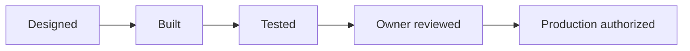

# Validation Summary

GoNica treats testing as separate from discussion and design. A feature can be described, implemented, tested, owner-accepted, and production-authorized at different times.

## Selected validated areas

- Governed GoHighLevel bridge: synthetic/sanitized acceptance tests completed successfully across the selected test set.
- CRM migration/preservation: selected offline validation demonstrated preservation and mapping behavior on defined cases.
- GoNica Tours private-review website: automated content/security/build checks passed before owner review.
- Repository/control-plane discipline: manifests, savepoints, hashes, and recovery checkpoints are maintained as part of the operating method.
- Safety boundaries: production and external execution can remain intentionally blocked even when lower-level tests pass.

## Validation pattern

These states are intentionally not collapsed into one label.

## Why this matters

AI-assisted development can create a dangerous illusion of completion. A system may sound coherent in conversation while the actual implementation is incomplete, stale, or unverified. GoNica therefore attempts to preserve evidence of the real state instead of relying on narrative memory alone.

## Evidence categories used internally

- Authority and scope documents
- Implementation artifacts
- Test output
- Synthetic/sanitized acceptance cases
- Failure and exception records
- Hashes and manifests
- Savepoints and continuation records
- Owner decisions and production gates

## Public-room limitation

This repository provides a reduced review surface. The private control plane contains substantially more detailed evidence, but unrestricted private source material, credentials, customer information, and sensitive operational data are intentionally excluded here.
